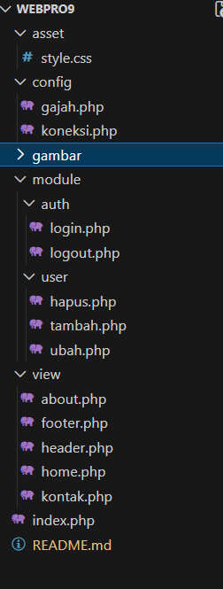

# Latihan Modular PHP


Halo halo, Sekarang disini akan mencoba menggunakan PHP dan MySQL dengan lebih Modular.
Cek juga repo lain yang membahas
 [Html dasar](https://github.com/laLafid/Lab1Web), [CSS dasar](https://github.com/laLafid/lab2web), [CSS](https://github.com/laLafid/Lab3Web), [CSS Layout](https://github.com/laLafid/Lab4Web), [Dasar Javascript](https://github.com/laLafid/Lab5Web), [Dasar Bootstarp](https://github.com/laLafid/Lab6Web) dan [Dasar PHP](https://github.com/laLafid/Lab6Web), [CRUD PHP](https://github.com/laLafid/Lab8Web)


## Langkah-langkah

1. **Persiapan**
    - Editornya, misal Visual Studio Code.
    
    - XAMPP, kalo belum punya unduh dulu di [sini](https://www.apachefriends.org/).


2. **Siapkan MySQL**
    - Buka XAMPP control panel dulu, aktifin ``apache`` dan ``mysql`` lalu pencet admin dibagian ``mysql`` buat masuk ke phpmyadmin.
    


3. **eXAMPP PHPmyAdmin**
    Pake Database sebelumnya, kalo belum punya boleh
    - Buat Database dulu
    


    - Tambahin Tabel
    

    buat tabel lewat tab SQL. 
    
    ```sql
    CREATE TABLE data_barang (
        id_barang int(10) auto_increment Primary Key,
        kategori varchar(30),
        nama varchar(30),
        gambar varchar(100),
        harga_beli decimal(10,0),
        harga_jual decimal(10,0),
        stok int(4)
    );
    ```

    - Tabel nya diisi 
    

    lewat tab SQL juga, isi pake data biar ada.
    
    ```sql
    INSERT INTO data_barang (kategori, nama, gambar, harga_beli, harga_jual, stok)
    VALUES ('Elektronik', 'HP Samsung Android', 'hp_samsung.jpg', 2000000, 2400000, 5),
    ('Elektronik', 'HP Xiaomi Android', 'hp_xiaomi.jpg', 1000000, 1400000, 5),
    ('Elektronik', 'HP OPPO Android', 'hp_oppo.jpg', 1800000, 2300000, 5);
    ```

    - Koneksi Database pake PHP

    
    
    buat file baru ``koneksi.php``.
    ```php
    <?php
    $host = "localhost";
    $user = "root";
    $pass = "";
    $db = "latihan1";
    $conn = mysqli_connect($host, $user, $pass, $db);
    if ($conn == false) {
        echo "Koneksi ke server gagal.";
        die();
    } else echo "Koneksi berhasil";
    ?>
    ```


4. **Modulo?**
    
    nah karena kita mau buat projek sebelumnya jadi modular, susun dulu file dan folder nya seperti ini:
    

45. **Ada beberapa tambahan dan perubahan dari yang sebelumnya:**

    header.php, gak perlu buat banyak header di banyak tempat
    ```php
    <!DOCTYPE html>
    <html lang="en">

    <head>
        <meta charset="UTF-8">
        <title>Contoh Modularisasi</title>
        <meta name="viewport" content="width=device-width, initial-scale=1.0">
        <link href="<?= BASE_URL ?>asset/style.css" rel="stylesheet" type="text/css" />
    </head>

    <body>
        <div class="container">
            <header>
                <h1>Modularisasi Menggunakan Require</h1>
            </header>
            <nav>
            // mereka begini biar mudah navigasinya, mengatassi massalah pathing(minor sebenarnya tapi less effort aja)
                <a href="<?= BASE_URL ?>view/home.php">Home</a>
                <a href="<?= BASE_URL ?>view/about.php">Tentang</a>
                <a href="<?= BASE_URL ?>view/kontak.php">Kontak</a>
            </nav>
            <?php if (isset($_SESSION['login'])) {?>
                <div class="greeting">
                    <span style="color:#667eea; font-weight:600;">Hai, <?= $_SESSION['nama'] ?>!</span><br>
                    <a href="<?= BASE_URL ?>module/auth/logout.php" class="btn btn-danger">Logout</a>
                </div>
            <?php } ?>  
    ```

    footer.php, nice
    ```php
            <footer>
                <p>&copy; 2021, Informatika, Universitas Pelita Bangsa</p>
            </footer>
        </div>
    </body>

    </html>
    ```

    - [ini elemen (not so much)penting](https://github.com/laLafid/Lab9Web/blob/8d88ce25ff7c263b7d7905a9e2414dc74a1b443d/config/gajah.php) mention pake 
    ```php 
    require_once __DIR__ . 'config/gajah.php'; //pathing tetap tergantung dari mana dipanggilnya ya 
    ```

    - cara penggunaan header.php dan footer.php
    ```php
    <?php 
    require_once __DIR__ . '/../config/gajah.php'; //mention dulu kalo pake yang ada di gajah.php juga
    require ROOT . 'view/header.php'; ?> // bisa juga langsung mention di sini ubah aja ke __DIR__ . 'buka_file_apa', tapi harus sesuai dengan penempatannya ya 
    <div class="container">
        <h1>Ini Halaman About</h1>
        <p>Ini adalah bagian content dari halaman.</p>
    </div>
    <?php require ROOT . 'view/footer.php'; ?> //panggil
    ```

    - fungsi index pindah ke home.php, sekarang index dipakai sebagai penyambut aja

    - [login.php](https://github.com/laLafid/Lab9Web/blob/8d88ce25ff7c263b7d7905a9e2414dc74a1b443d/module/auth/login.php) dan [logout.php](https://github.com/laLafid/Lab9Web/blob/8d88ce25ff7c263b7d7905a9e2414dc74a1b443d/module/auth/logout.php) tidak akan berbicara banyak selain 'tugas mereka adalah nampilin modal login dan logout'.

    - karena semua filenya pindah tempat jadi harus teliti di hal-hal pemanggilan file


5. **Hasil Akhir**

    Tampilan setelah diberi css.
    
    

    

    

    
## Akhri Kata


*Selamat mencoba*
