# Latihan Modular PHP


Halo halo, Sekarang disini akan mencoba menggunakan PHP dan MySQL dengan lebih Modular.
Cek juga repo lain yang membahas
 [Html dasar](https://github.com/laLafid/Lab1Web), [CSS dasar](https://github.com/laLafid/lab2web), [CSS](https://github.com/laLafid/Lab3Web), [CSS Layout](https://github.com/laLafid/Lab4Web), [Dasar Javascript](https://github.com/laLafid/Lab5Web), [Dasar Bootstarp](https://github.com/laLafid/Lab6Web) dan [Dasar PHP](https://github.com/laLafid/Lab6Web), [CRUP PHP](https://github.com/laLafid/Lab8Web)


## Langkah-langkah

1. **Persiapan**
    - Editornya, misal Visual Studio Code.
    
    - XAMPP, kalo belum punya unduh dulu di [sini](https://www.apachefriends.org/).

2. **Siapkan MySQL**
    - Buka XAMPP control panel dulu, aktifin ``apache`` dan ``mysql`` lalu pencet admin dibagian ``mysql`` buat masuk ke phpmyadmin.
    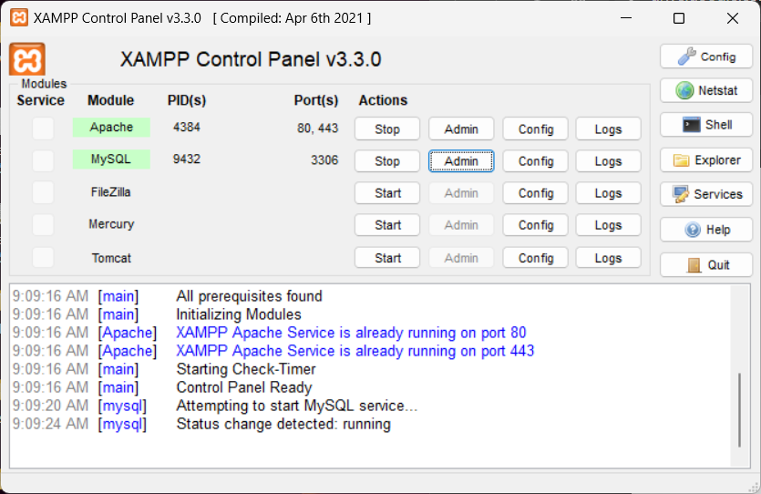

3. **eXAMPP PHPmyAdmin**

    - Buat Database dulu
    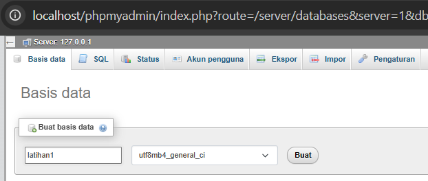


    - Tambahin Tabel
    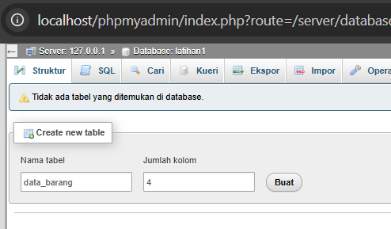

    buat tabel lewat tab SQL. 
    
    ```sql
    CREATE TABLE data_barang (
        id_barang int(10) auto_increment Primary Key,
        kategori varchar(30),
        nama varchar(30),
        gambar varchar(100),
        harga_beli decimal(10,0),
        harga_jual decimal(10,0),
        stok int(4)
    );
    ```

    - Tabel nya diisi 
    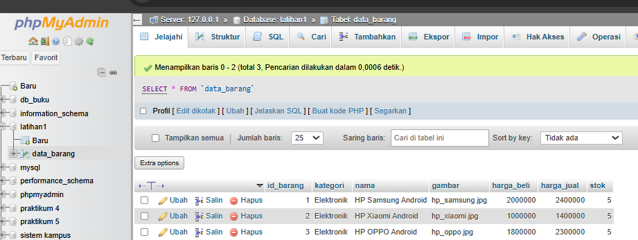

    lewat tab SQL juga, isi pake data biar ada.
    
    ```sql
    INSERT INTO data_barang (kategori, nama, gambar, harga_beli, harga_jual, stok)
    VALUES ('Elektronik', 'HP Samsung Android', 'hp_samsung.jpg', 2000000, 2400000, 5),
    ('Elektronik', 'HP Xiaomi Android', 'hp_xiaomi.jpg', 1000000, 1400000, 5),
    ('Elektronik', 'HP OPPO Android', 'hp_oppo.jpg', 1800000, 2300000, 5);
    ```

    - Koneksi Database pake PHP

    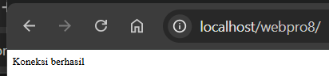
    
    buat file baru ``koneksi.php``.
    ```php
    <?php
    $host = "localhost";
    $user = "root";
    $pass = "";
    $db = "latihan1";
    $conn = mysqli_connect($host, $user, $pass, $db);
    if ($conn == false) {
        echo "Koneksi ke server gagal.";
        die();
    } else echo "Koneksi berhasil";
    ?>
    ```

    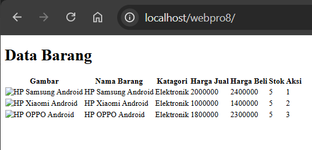

    satu lagi ``index.php`` buat baca isi database dan nampilin secara webview(belum dikasih css). 


    - Buat file php untuk Buat, 
    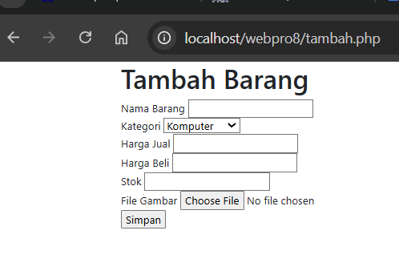
    [tambah.php](https://github.com/laLafid/Lab8Web/blob/bf9b36adf779856239dfa021ea572ec23bebcf30/tambah.php)    

    Ubah,
    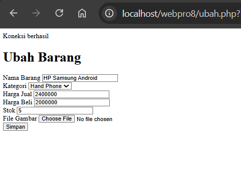
    [ubah.php](https://github.com/laLafid/Lab8Web/blob/bf9b36adf779856239dfa021ea572ec23bebcf30/ubah.php)

    Hapus (kejadian setelah)
    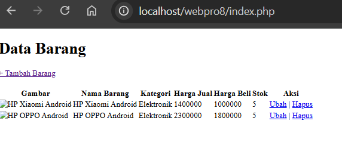
    [hapus.php](https://github.com/laLafid/Lab8Web/blob/bf9b36adf779856239dfa021ea572ec23bebcf30/hapus.php)

4. **Hasil Akhir**

    Tampilan setelah diberi css.
    
    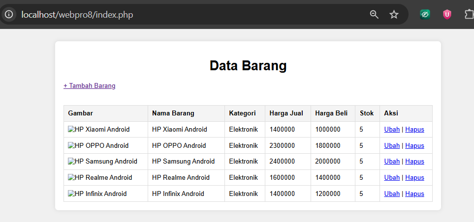

    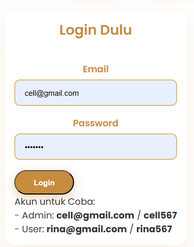

    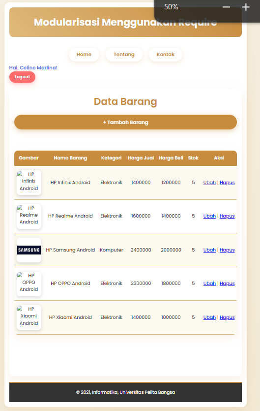

    
## Akhri Kata


*Selamat mencoba*
